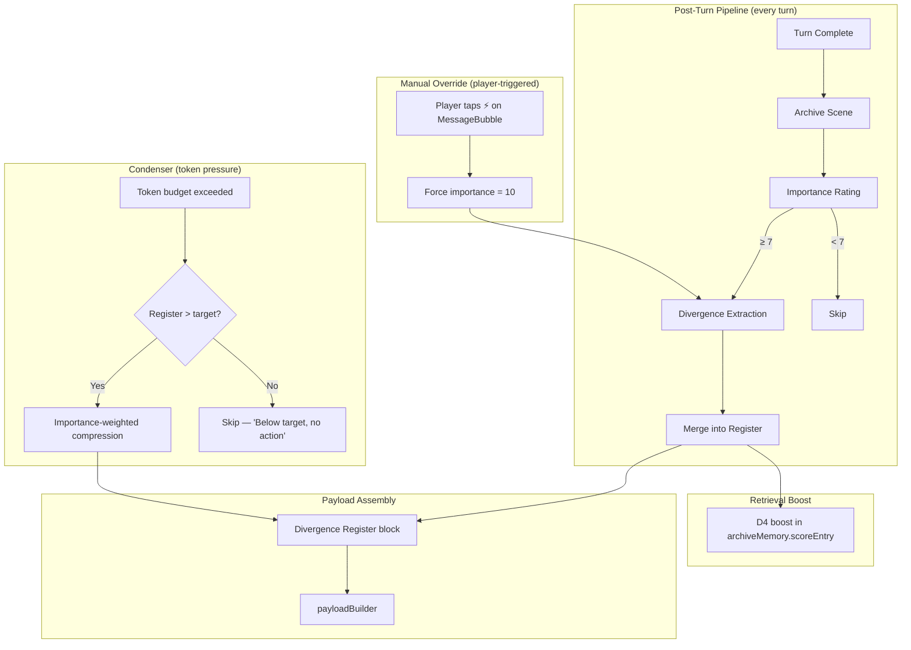

# Campaign Divergence Register — Design v4

## Architecture Overview



---

## 1. Manual Divergence Tagging (Player Override)

### Problem
The importance rater is a heuristic + single LLM call. It WILL miss things. "I convince the goblin king to join me" might rate as 6 (notable) when it's actually a 9 (campaign-changing). The player knows better.

### UI: MessageBubble Action Button

Add a **⚡ (zap/divergence) button** to the message action bar on assistant messages:

```
Current actions:  [Edit ✏️] [Regenerate ↻] [Delete 🗑️]
New actions:      [Edit ✏️] [Regenerate ↻] [⚡ Tag Divergence] [Delete 🗑️]
```

In [MessageBubble.tsx](file:///d:/Games/AI%20DM%20Project/Automated_system/mobileApp/src/components/chat/MessageBubble.tsx), alongside existing Edit/Regenerate/Delete buttons (lines 43-55):

```tsx
{msg.role === 'assistant' && (
    <button 
        title="Tag as Divergence" 
        onClick={() => onTagDivergence(msg)}
        className={`text-text-dim hover:text-amber-400 p-1 bg-void-lighter rounded ${
            msg.hasDivergence ? 'text-amber-400' : ''
        }`}
    >
        <Zap size={10} />
    </button>
)}
```

### Behavior on Tap

1. Player taps ⚡ on any assistant message
2. System sets a **separate `manuallyTagged: true` flag** on that archive index entry (importance score stays honest — see note below)
3. Triggers divergence extraction for that scene (same LLM call as auto-extraction)
4. Shows a brief toast: *"Scanning for divergences..."*
5. On completion: toast *"2 divergences captured"* or *"No divergences found — add manually?"*

> **Why not force importance = 10?** Importance feeds retrieval scoring (D2). Forcing it to 10 makes a tagged scene permanently outrank genuine 9s. Keep importance honest; use a dedicated `manuallyTagged` flag for "player flagged this," and rely on the D4 divergence-link boost for retrieval (a manually-tagged scene will have divergence entries linked anyway, so D4 covers it).

> **Note on extraction:** the ⚡ tap **bypasses the importance ≥ 7 gate** and always runs extraction. So a player-tagged scene with heuristic importance 5 still produces divergence entries that land in the fact sheet. The `manuallyTagged` flag is metadata on the archive entry; the actual fact-sheet content comes from the extraction step.

If AI finds nothing, offer a **manual entry modal** — small form:
```
Subject:     [Goblin King Grak          ]
Divergence:  [Now allied with player    ]
Category:    [npc_fate ▼]
```

### Visual Indicator: Divergence Badge

After a message has divergences linked to it, show a small badge:

```tsx
{msg.hasDivergence && (
    <div className="absolute -left-1 top-1/2 -translate-y-1/2 w-1.5 h-1.5 rounded-full bg-amber-400 animate-pulse" 
         title="Divergence tracked" />
)}
```

This is a **glowing amber dot** on the left edge of the message bubble — subtle but visible when scrolling back through history. Player can see at a glance which turns changed the world.

### Determining `hasDivergence`

The `ChatMessage` type gets a new optional field:

```typescript
type ChatMessage = {
    // ... existing fields
    divergenceIds?: string[];  // IDs of DivergenceEntry linked to this message's scene
};
```

When divergence extraction completes (auto or manual), the originating message gets patched:
```typescript
callbacks.updateLastMessage({ divergenceIds: ['div_001', 'div_003'] });
```

---

## 2. Condenser Rework — Smart Compression with Token Target

### Current Problem
- Hard 6k META_SUMMARY_THRESHOLD triggers lossy T3→T4 compression
- No way for player to control target size
- Compresses everything equally — golden sword gets same weight as fiery sword

### New Design: Token Target Budget

#### Settings UI

In [SettingsModal.tsx](file:///d:/Games/AI%20DM%20Project/Automated_system/mobileApp/src/components/SettingsModal.tsx), replace the current auto-condense toggle with:

```
┌─────────────────────────────────────────────┐
│ DIVERGENCE REGISTER                         │
│                                             │
│ Auto-extract: [ON/OFF toggle]               │
│ Compress history at 75% limit               │
│                                             │
│ Register Token Budget: [2000] tokens        │
│ ────────────────────●───────── (500-6000)   │
│                                             │
│ [AI Summary ▶] Manually trigger compression │
│                                             │
│ Status: 847 / 2000 tokens (below target)    │
└─────────────────────────────────────────────┘
```

#### Cost Trajectory: Register vs. Condenser

The fact sheet is injected into every story-AI prompt, just like the condensed history is today. So the *kind* of cost is the same — a structured block in every turn. The win is in the trajectory:

| Phase | What's injected per turn | Approx. cap |
|---|---|---|
| Today | Condensed prose history | ~6k tokens |
| Transition (Phases 1–4) | Condenser + Register | ~6k + ~2k = ~8k |
| End state (Phase 5+, condenser retired) | Register only | ~2k (budget-capped) |

During the transition both systems coexist and per-turn cost goes up. The structural payoff arrives when the condenser retires: the register is denser per token (structured bullets vs. prose), tighter-budgeted, and more authoritative (told to override training data). Net long-term: less spend, more reliable canon.

#### "AI Summary" Button Behavior

```
1. Player taps [AI Summary]
2. System checks: register tokens vs target budget
3. IF register < target budget:
     → Toast: "Register is 847/2000 tokens — no compression needed"
     → Done, no LLM call
4. IF register ≥ target budget:
     → Run importance-weighted compression
     → Show result in CondensedMemoryPanel for review
```

#### Importance-Weighted Compression

When the register exceeds the token target, compress **selectively**:

```
Priority tiers:
  Tier 1 (importance 9-10): NEVER compress. Keep full detail.
  Tier 2 (importance 7-8):  Light compression. Keep subject + key fact.
  Tier 3 (importance 5-6):  Heavy compression. One-line summary only.
  Tier 4 (importance ≤ 4):  Merge or drop. Only keep if still referenced.
```

**The golden sword example:**

Before compression (1200 tokens):
```
• [Scene #005, imp:6] Player acquired Golden Sword of the North from dungeon chest
• [Scene #012, imp:5] Player used Golden Sword to defeat the Stone Guardian  
• [Scene #028, imp:8] Player acquired Fiery Blade of Ashengarde from dragon's hoard
• [Scene #031, imp:7] Golden Sword traded to blacksmith for 200 gold
```

After importance-weighted compression (400 tokens):
```
• [Scene #005→#031, imp:4] Golden Sword of the North: ACQUIRED then TRADED to blacksmith for 200g
• [Scene #028, imp:8] Fiery Blade of Ashengarde: IN PLAYER POSSESSION — looted from dragon's hoard
```

The golden sword's 4 entries collapsed into 1 low-priority line because:
- Scene #031 superseded Scene #005 (traded away → no longer relevant)
- The fiery sword is higher importance and current → kept full

#### Compression Strategy: Programmatic Tier 1 Split

Asking the LLM to "not touch" Tier 1 entries is unreliable — LLMs sometimes drop or paraphrase protected entries. Instead, **slice Tier 1 out programmatically before the LLM sees it**, then re-merge.

```
1. Split register by importance:
     protected = entries where importance >= 9   (Tier 1 — never sent to LLM)
     compressible = entries where importance < 9 (Tiers 2–4 — sent to LLM)
2. Send only `compressible` to compression LLM with the prompt below.
3. Receive compressed entries back.
4. Re-merge:  final = [...protected, ...compressed]
5. Sort by sceneRef ascending to preserve chronological order.
```

This guarantees Tier 1 entries are byte-for-byte preserved regardless of LLM behavior, and keeps the timeline order intact.

#### Compression Prompt (for Tiers 2–4 only)

```
You are compressing part of a campaign divergence register to fit a token budget.

ENTRIES TO COMPRESS ({currentTokens} tokens, target: {targetTokens} tokens):
{compressibleEntries}

COMPRESSION RULES:
1. Importance 7-8: Compress to one line but keep all proper nouns.
2. Importance 5-6: Aggressively compress. Merge related entries by subject.
3. Importance ≤ 4: Drop if superseded. Merge into parent if related.
4. If an item was ACQUIRED then LOST/TRADED, merge into one line noting final state.
5. Preserve ALL proper nouns exactly as written.
6. Preserve sceneRef on each output entry (use earliest sceneRef when merging).
7. Target: {targetTokens} tokens.

OUTPUT: Compressed entries in the same JSON format.
```

---

## 3. Full Data Model (v4)

```typescript
type DivergenceCategory =
    | 'canon_override'      // Contradicts training data / source material (e.g. Hiruzen alive)
    | 'world_change'        // Permanent map/world state (e.g. Thornfield burned)
    | 'entity_state'        // NPCs, items, factions and their current status (allied, dead, traded, exposed)
    | 'player_state'        // Player abilities, titles, curses, secret knowledge gained
    | 'obligation';         // Debts, promises, oaths owed by/to player

type DivergenceEntry = {
    id: string;
    category: DivergenceCategory;
    subject: string;            // Entity affected
    divergence: string;         // One-line factual statement
    sceneRef: string;           // Scene ID where divergence was ESTABLISHED
    linkedSceneIds: string[];   // All scenes where this divergence matters
    importance: number;         // From importance rater (honest score, no manual override)
    supersedes?: string;        // ID of older entry this replaces (set by extraction LLM, not heuristic)
    resolved?: boolean;         // For obligations — flipped manually via Quest panel UI
    source: 'auto' | 'manual';  // How it was created
};

type DivergenceRegister = {
    entries: DivergenceEntry[];
    lastUpdatedSceneId: string; // Last scene where extraction ran
    lastUpdatedAt: number;      
    version: number;
};

// Settings addition
type AppSettings = {
    // ... existing fields
    autoExtractDivergences: boolean;   // replaces autoCondenseEnabled for this system
    divergenceTokenBudget: number;     // default 2000, range 500-6000
};

// ChatMessage addition
type ChatMessage = {
    // ... existing fields
    divergenceIds?: string[];  // Links to DivergenceEntry IDs for this scene
};
```

---

## 4. Pipeline: Post-Turn Divergence Extraction

### Combined Importance + Extraction Call

To save cost on a weaker context model (e.g. DeepSeek V4 Flash), the importance-rate and divergence-extract steps are **fused into a single LLM call** per turn. One prompt, one response.

```
Turn complete → turnPostProcess.handlePostTurn()
  ├── Archive scene (get appendedSceneId — sceneId is stable & synchronous)
  ├── Refresh archive index
  ├── Fetch semantic facts
  ├── Auto-seal chapter check
  │
  ├── backgroundQueue: Rate-and-Extract (LLM)      ← FUSED
  │     ├── Input: scene text + CURRENT REGISTER
  │     ├── Output: { importance: N, newEntries: [...], supersedes: [...] }
  │     ├── If importance < 7 AND no entries → done
  │     ├── Else: merge entries into register
  │     ├── Patch message (looked up by message ID, not "last")
  │     └── Update lastUpdatedSceneId
  │
  ├── NPC detection + profile gen
  ├── Profile scan (periodic)
  └── Inventory scan (periodic)
```

### Manual extraction (player override)

```
Player taps ⚡ on MessageBubble
  ├── Set archive entry's manuallyTagged = true (importance untouched)
  ├── Run extraction (same prompt as auto, same register-aware merge)
  ├── If AI finds entries → merge + patch message + toast
  └── If AI finds nothing → offer manual entry modal
```

### Merge & Supersede Strategy (the hard part — explicit)

The extraction prompt **always includes the current register** so the LLM can detect updates rather than create duplicates. The LLM emits `supersedes: "div_007"` when a new entry replaces an existing one. Sketch:

```
EXISTING REGISTER ({tokenCount} tokens):
div_007 [Scene #005, imp:6] entity_state — Golden Sword of the North: in player possession
div_012 [Scene #012, imp:9] canon_override — Hiruzen Sarutobi: ALIVE (player intervened)
...

NEW SCENE TEXT (Scene #031):
[scene transcript]

TASK:
1. Rate this scene's importance 1–10.
2. If importance ≥ 7, extract divergences.
3. For each new fact: if it updates an existing entry above, return its ID in `supersedes`.
4. Preserve proper nouns exactly as written in the scene.

OUTPUT JSON: { importance, newEntries: [{category, subject, divergence, supersedes?}] }
```

This handles the multi-name NPC problem (Hiruzen / Third Hokage / Sarutobi-sensei) — the LLM sees the existing entry and knows the new scene is talking about the same person, so it supersedes rather than duplicates.

**Why not heuristic subject matching?** String matching catches "Golden Sword" ↔ "golden blade" but fails on NPC aliases. Putting the register in the prompt is more reliable, and the token budget keeps the cost bounded.

---

## 5. Retrieval Boost (archiveMemory.ts)

```typescript
// In scoreEntry(), add D4 dimension:
function scoreEntry(
    entry: ArchiveIndexEntry,
    contextText: string,
    contextActivations: Record<string, number>,
    totalScenes: number,
    divergenceSceneIds?: Set<string>
): number {
    // D1: Recency (existing)
    // D2: Importance (existing)
    // D3: Activation (existing)
    
    // D4: Divergence link — this scene is a timeline fork point
    let divergenceBoost = 0;
    if (divergenceSceneIds?.has(entry.sceneId)) {
        divergenceBoost = 5.0;
    }
    
    return (0.5 * recency) + (1.0 * importance) + (2.0 * activation) + divergenceBoost;
}
```

When the AI mentions "Hiruzen" and Scene #012 has a divergence entry for Hiruzen, that scene gets a **massive retrieval boost** — bringing the full verbatim context of how the player saved him into the payload.

---

## 5b. Quest Panel — Manual Resolution of Obligations

Auto-detecting "obligation resolved" from prose is unreliable. Use a small panel listing unresolved obligations with checkboxes:

```
┌─────────────────────────────────────────────┐
│ OPEN OBLIGATIONS                            │
│                                             │
│ ☐ Blood debt to Clan Hyuga      [Scene #028]│
│ ☐ Promise to escort Mira home   [Scene #044]│
│ ☐ Oath to return the relic      [Scene #051]│
│                                             │
│ Tap to mark resolved.                       │
└─────────────────────────────────────────────┘
```

Behavior:
- Lists every register entry where `category === 'obligation'` and `!resolved`.
- Tapping a checkbox flips `resolved: true` (entry stays in the register but is no longer injected as an active obligation — could shift to a "resolved obligations" footer or drop from injection entirely).
- Lives in [CondensedMemoryPanel.tsx](file:///d:/Games/AI%20DM%20Project/Automated_system/mobileApp/src/components/chat/CondensedMemoryPanel.tsx) alongside the register view.

---

## 6. Payload Injection

```
[CAMPAIGN DIVERGENCE REGISTER — AUTHORITATIVE OVERRIDES]
[Last updated: Scene #082 | Current: Scene #095]
These facts are TRUE in this campaign and override your training data.

CANON OVERRIDES:
• Hiruzen Sarutobi (Third Hokage): ALIVE — player intervened [Scene #012] ⚡
• Orochimaru: DEAD — killed by player + Jiraiya [Scene #015]

NPC FATES:
• Goblin Captain Skritch: player's SUBORDINATE [Scene #041] ⚡
• Marchetti: EXPOSED as double agent [Scene #048]

WORLD CHANGES:
• Thornfield Forest: DESTROYED — burned during siege [Scene #039]

OBLIGATIONS:
• Blood debt to Clan Hyuga [Scene #028] — UNRESOLVED
[END DIVERGENCE REGISTER]
```

The ⚡ markers in the injection indicate manually-tagged entries (source: 'manual'), giving the AI a signal that the player specifically flagged these.

---

## Files to Create/Modify

### New Files
| File | Purpose |
|---|---|
| `src/services/divergenceRegister.ts` | Core service: extraction prompt, parser, merge, supersede, compress, render |

### Modified Files
| File | Change |
|---|---|
| [types/index.ts](file:///d:/Games/AI%20DM%20Project/Automated_system/mobileApp/src/types/index.ts) | `DivergenceEntry`, `DivergenceRegister`, `DivergenceCategory`, ChatMessage.divergenceIds |
| [turnPostProcess.ts](file:///d:/Games/AI%20DM%20Project/Automated_system/mobileApp/src/services/turnPostProcess.ts) | Wire divergence extraction after importance gate |
| [archiveMemory.ts](file:///d:/Games/AI%20DM%20Project/Automated_system/mobileApp/src/services/archiveMemory.ts) | D4 divergence boost in scoreEntry |
| [payloadBuilder.ts](file:///d:/Games/AI%20DM%20Project/Automated_system/mobileApp/src/services/payloadBuilder.ts) | Render register block (new classification: 'divergence') |
| [turnTypes.ts](file:///d:/Games/AI%20DM%20Project/Automated_system/mobileApp/src/services/turnTypes.ts) | Add divergence register to TurnState + callbacks |
| [chatSlice.ts](file:///d:/Games/AI%20DM%20Project/Automated_system/mobileApp/src/store/slices/chatSlice.ts) | Divergence register state + actions |
| [MessageBubble.tsx](file:///d:/Games/AI%20DM%20Project/Automated_system/mobileApp/src/components/chat/MessageBubble.tsx) | ⚡ button + amber dot indicator |
| [CondensedMemoryPanel.tsx](file:///d:/Games/AI%20DM%20Project/Automated_system/mobileApp/src/components/chat/CondensedMemoryPanel.tsx) | Rework to show register + AI Summary button |
| [SettingsModal.tsx](file:///d:/Games/AI%20DM%20Project/Automated_system/mobileApp/src/components/SettingsModal.tsx) | Token budget slider + auto-extract toggle |
| [TokenGauge.tsx](file:///d:/Games/AI%20DM%20Project/Automated_system/mobileApp/src/components/TokenGauge.tsx) | Register token accounting |
| [Header.tsx](file:///d:/Games/AI%20DM%20Project/Automated_system/mobileApp/src/components/Header.tsx) | Save/load register |

### NOT Modified Yet (planned for retirement)
| File | Reason |
|---|---|
| [condenser.ts](file:///d:/Games/AI%20DM%20Project/Automated_system/mobileApp/src/services/condenser.ts) | Stays for now to avoid one big rewrite. **Planned removal in follow-up phase** — once the register lands, chapter sealing + semantic search + register injection cover what the prose summary does today. |

---

## Implementation Tasks

### Phase 1: Core Register
- [ ] **T1**: Types — `DivergenceEntry`, `DivergenceRegister`, `DivergenceCategory`
- [ ] **T2**: `divergenceRegister.ts` — extraction prompt, JSON parser, merge/supersede logic
- [ ] **T3**: Register renderer — format entries for payload injection
- [ ] **T4**: Wire into `turnPostProcess.ts` — after importance gate
- [ ] **T5**: Store + save/load — chatSlice, Header, campaignStore

### Phase 2: Retrieval Integration
- [ ] **T6**: D4 divergence boost in `archiveMemory.ts` scoreEntry
- [ ] **T7**: Pass divergence scene IDs through contextRecommender
- [ ] **T8**: `payloadBuilder.ts` — add register block

### Phase 3: Manual Override UI
- [ ] **T9**: MessageBubble ⚡ button + amber indicator dot
- [ ] **T10**: Manual extraction trigger (set `manuallyTagged` flag on archive entry, run extraction — do NOT mutate importance)
- [ ] **T11**: Manual entry modal (fallback when AI finds nothing)
- [ ] **T12**: ChatMessage.divergenceIds linking (lookup target message by ID, never assume "last message")
- [ ] **T12b**: Quest Panel — list unresolved obligations with checkbox to flip `resolved: true`

### Phase 4: Smart Compression
- [ ] **T13**: Token budget setting — slider in SettingsModal (500-6000, default 2000)
- [ ] **T14**: "AI Summary" button — check budget, skip if under
- [ ] **T15**: Importance-weighted compression prompt + logic
- [ ] **T16**: CondensedMemoryPanel rework — show register + compression controls
- [ ] **T17**: TokenGauge accounting

---

## Open Questions

> [!IMPORTANT]
> 1. **Importance gate threshold** — 7 catches "significant" scenes (combat, reveals, relationship shifts). Lower to 6 to also catch "notable" scenes? Or keep 7 and rely on manual ⚡ for edge cases?

> [!IMPORTANT]
> 2. **Manual entry modal** — When AI finds nothing on a manually-tagged scene, should we show a simple form (subject/divergence/category), or a text box where the player describes the divergence and AI structures it?

> [!IMPORTANT]
> 3. **Register injection cost** — register goes into every story-AI prompt every turn (so canon never breaks). Confirm DeepSeek V4 Flash supports prefix caching; if not, the cost is real and the token budget setting becomes load-bearing.

---

## Roadmap

- **Phase 1–4** — Build the register alongside the existing condenser. Both inject simultaneously. Per-turn cost rises temporarily.
- **Phase 5 (committed, not optional)** — Retire the condenser. Chapter sealing + semantic search + register injection cover what the prose summary does today. Per-turn injection drops to register-only (~2k budget-capped). This is the milestone that makes the whole rework pay off.
